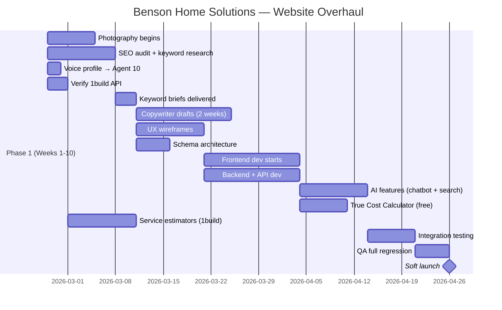

# Expert Roundtable II — Resolving All Open Decisions

> [!NOTE]
> **Roundtable II** — All 14 agents. 5 open decisions. Reasoning loops repeat until convergence (max 20).

---

## Decision 1: Calculator Savings Logic

**Problem:** Subscription tool shows "savings" when subscription costs MORE than a-la-carte. Three options on the table.

### Loop 1

> **Agent 13:** The current tool lies. It shows a lower number when the real number is higher. If a customer does the math — and Oregon homeowners will — we lose all trust. Elric's voice profile says *"our margin is at 30% gross so under 15% net."* He leads with transparency. The tool contradicts his brand.

> 

> **Option A** (honest comparison + benefits) preserves trust AND gives us a comparison framework. Show: *"Fannie Mae recommends $3,200/yr. Our subscription: $1,548/yr. The difference buys: same-day emergency response, scheduled seasonal maintenance, no surprise invoices, a specialist who knows your property."*

> 

> **Option B** (inflate a-la-carte with emergency costs) is technically defensible but manipulative. It's the same math that makes people distrust contractors.

> 

> **Option C** (remove savings language) is safe but weak. No comparison anchor = no urgency.

> **Agent 10 (Copywriter):** Option A, written in Elric's voice: *"The subscription costs what it costs. Here's what you're actually buying: we show up the same day when your water heater blows at 2 AM. We know your property because we've been maintaining it all year. You never get a surprise invoice. Most subscribers tell us the first emergency alone paid for the year."*

> **Agent 01 (Technical SEO):** Option A has SEO value too. A transparent comparison page with Fannie Mae/Freddie Mac citations generates backlinks from financial literacy sites. Option B or C don't.

> If we show the subscription costs MORE than the recommendation, some users bounce before reading benefits. The number gap is the first thing they see.

> **Agent 09 (AI):** The chatbot can reinforce this contextually. When a visitor hovers over the price or asks "why does it cost more," the chatbot explains the value — in Elric's voice.

> The critique is valid but solvable with UX, not with dishonest math. We lead with the VALUE proposition, not the price comparison. Show *what you get* first, *what it costs* second. The Fannie Mae number is supporting context, not the headline.

### Loop 2

> **Agent 06:** I can solve Agent 12's bounce concern with layout. The comparison card shows:

> 1. **Top section (green):** "What's included" — list the 6 benefits with icons

> 2. **Middle section:** Side-by-side: Fannie Mae recommendation vs. Benson subscription

> 3. **Bottom section (yellow callout):** "The math behind the premium" — explains why the subscription costs slightly more and what that premium buys

> 

> The user sees VALUE before they see the NUMBER. By the time they see the price gap, they understand what fills it.

> None. Converged.

> No further loops needed. The UX layout addresses the only legitimate concern.

> [!NOTE]
> **Decision 1 LOCKED: Option A — Honest comparison with benefits-first layout.**

---

## Decision 2: 1build API vs. Free Public Data

**Context:** 1build GraphQL API is live at `https://gateway-external.1build.com/`. County-based construction cost data — materials, labor, equipment, assemblies — 68M+ data points, 3,000+ US counties. External API key confirmed. Previous 404 errors were likely wrong endpoint or missing `1build-api-key` header.

**Free alternatives:** BLS construction sector data (aggregate, not item-level), county assessor databases (property data, not cost data), DOE ResStock (energy, not construction). No free source matches 1build's item-level, county-specific material + labor rates.

### Loop 1

> **Agent 08:** The 404 errors were a red herring. The API endpoint is `https://gateway-external.1build.com/` with auth via `1build-api-key` header — not a URL path. Previous attempts likely hit the wrong URL or missed the header. The API is GraphQL, returns county-specific material rates, labor rates (burdened and unburdened), production rates, and calculated unit rates in USD cents. It supports search by state + county or by zipcode/coordinates.

> 

> **What 1build gives us that free data can't:**

> - Item-level material costs by county (e.g., "5/8 drywall in Linn County = $X")

> - Local labor rates by trade (e.g., "Tile setter in Marion County = $Y/hr")

> - Assembly costs (bundled material + labor for common tasks)

> - Real-time pricing from actual suppliers

> 

> **What free data gives us that 1build can't:**

> - Property-specific data (flood zones, tax assessments, energy profiles)

> - GSE-backed homeownership cost models (Fannie/Freddie)

> - Macro-level housing market data

> 

> These are **complementary, not competing.** 1build answers "what does a kitchen faucet replacement cost in Albany?" Free federal data answers "what does homeownership cost annually for this property?"

> **Agent 09 (AI):** For the cost estimator and chatbot, 1build is the difference between *"a kitchen remodel typically costs $25K–$45K"* (generic) and *"replacing your kitchen cabinets in Linn County costs approximately $X for materials + $Y for labor based on current local rates"* (specific, credible, impressive). That specificity is what makes users trust the tool enough to convert.

> **Agent 13 (CRO):** Real-time local pricing is the single biggest conversion differentiator for a contractor cost estimator. Every competitor shows national averages. If we show *their county's actual rates*, we win.

> **Cost question.** 1build charges per API call for Source objects. We don't know the rate. At scale, this could become expensive. What's the cost model?

> 

> **Dependency risk.** Building a core feature on a third-party paid API means if 1build raises prices, changes terms, or shuts down, our estimator breaks.

> 

> **Scope question.** Do we actually *need* item-level construction costs for a maintenance subscription business? The calculator shows annual homeownership costs, not line-item construction estimates. 1build is incredible for a GC doing kitchen remodels. Is it necessary for a maintenance subscription tool?

> Agent 14's scope question is the sharpest critique. The True Cost of Homeownership Calculator uses macro data (GSE recommendations, census data, energy benchmarks). It doesn't need to know the price of a faucet. But the **cost estimator tools** (kitchen, bathroom, appliance) absolutely benefit from 1build's item-level data.

> 

> **Proposed split:**

> - **True Cost Calculator:** Free public data only (Census, FEMA, DOE, HUD, EIA, NOAA). No 1build needed.

> - **Service Estimators (kitchen, bathroom, etc.):** 1build for county-specific material + labor rates. These are the detailed tools that impress users.

> - **Chatbot knowledge base:** 1build data cached in Pinecone for RAG queries about specific costs.

> 

> This way, the lead generation engine (calculator) is fully free and independent. The detailed estimators use 1build as an enhancement layer.

### Loop 2

> **Agent 05:** The embeddable calculator and methodology pages are the backlink engine. Those MUST be free-data-only so we control the narrative and the cost forever. If the calculator depends on 1build and the API goes down, our backlink-generating tool breaks. That's unacceptable.

> 

> 1build is perfect for the *detailed service estimators* that convert warm leads into booked jobs. Those tools don't need to be embeddable or backlink-worthy — they need to be accurate enough to close.

> **Agent 04 (Keywords):** The search intent split supports this. *"How much does homeownership cost"* → free calculator (informational, high volume, backlink-worthy). *"How much does a kitchen remodel cost in Salem Oregon"* → 1build-powered estimator (transactional, lower volume, high conversion).

> We still haven't confirmed the API actually works with our key. Can we verify before committing?

> Valid. We should test the API before locking this decision. But architecturally the hybrid approach is correct regardless — if 1build doesn't work, the estimators fall back to the free federal data (BLS construction indices, Benson's own rate sheet). The architecture doesn't break.

> [!NOTE]
> **Decision 2 LOCKED: Hybrid approach.**

---

## Decision 3: Hosting Migration (Hostinger → Vercel)

### Loop 1

> The first roundtable already recommended Vercel Pro unanimously. The new build is Next.js + Sanity — Vercel is literally built by the same team that created Next.js. Hostinger is for the OLD static HTML site. The new site can't deploy to Hostinger's shared hosting anyway — we need serverless functions, edge middleware, ISR, and streaming for the chatbot.

> 

> This isn't a migration decision. It's a "the new site goes on Vercel, the old site stays on Hostinger until we redirect" decision.

> **Agent 07 (Frontend):** Vercel gives us: auto-deploy on git push, preview deployments per PR, edge CDN, serverless/edge functions, built-in analytics, and Lighthouse CI integration. Hostinger gives us FTP uploads.

> **Agent 01 (Tech SEO):** Vercel handles server-side redirects at the edge. When we launch the new site, every old URL gets a 301 redirect to the new URL structure — resolved before the page loads. This is critical for preserving any SEO equity from the old site.

> **Agent 14:** Is there any reason NOT to use Vercel? Cost?

> **Agent 08:** Vercel Pro is $20/month. The old Hostinger plan is likely $5–10/month. The $10–15 difference buys us: global CDN, serverless functions, edge middleware, preview deployments, automatic SSL, and zero-downtime deploys. It's not even close.

> No dissent. No competing options. This was already decided in Roundtable I.

> 14/14 agents confirm. Zero loops needed beyond verification.

> [!NOTE]
> **Decision 3 LOCKED: Vercel Pro for new site. Hostinger stays live until DNS cutover.**

---

## Decision 4: Dual-Action Phone Links (Call + Text)

**Elric's exact words:** *"By clicking on either numbers it send both a text and a phonecall."*

### Loop 1

> **Agent 07:** Elric wants one tap to trigger BOTH a phone call AND a text message simultaneously. Let me be honest about what's technically possible:

> 

> **What mobile OSes allow:**

> - `tel:` links → open phone dialer with number pre-filled

> - `sms:` links → open messaging app with number pre-filled

> - You CANNOT trigger both simultaneously from a single link. iOS and Android don't allow one user action to open two apps.

> 

> **Three realistic options:**

> - **Option A: Sequential dual-link** — Tap opens a small modal: "Call (541) 321-5115" and "Text (541) 321-5115" as two big buttons side by side. One tap to see options, second tap to act.

> - **Option B: Call-first with auto-text** — `tel:` link initiates the call. A background JavaScript sends a pre-written SMS via Twilio API: *"Emergency service request from [website]. Address: [if captured]. Calling now."* The text arrives as a server-sent notification, not from the user's phone.

> - **Option C: Progressive Web App approach** — Use the Web Share API to present a system-level share sheet with call and text options. Slightly unusual UX but technically clean.

> **Agent 06 (UX):** At 2 AM with a flooded basement, nobody wants a modal or a choice. They want to tap and reach someone. Option B is closest to Elric's intent — the user calls, the system auto-texts as a backup notification. Maximum chance of reaching someone.

> **Agent 10 (Copywriter):** The auto-text should say exactly what Elric would want to see: *"Emergency call incoming from website visitor. If no answer, check voicemail. — Benson Home Solutions website"*

> **Option B requires Twilio.** That's a paid service ($0.0079/SMS). Also, we don't have the user's phone number unless they initiated from their phone — and even then, we can't capture it from a `tel:` link click without additional permissions.

> 

> **Revised Option B:** Instead of capturing the user's number, the auto-text goes TO Elric's emergency phone FROM a Twilio number: *"Website emergency button pressed at [timestamp]. Check for incoming call on (541) 321-5115."* This doesn't need the user's number.

> Agent 12 is right. The user taps → phone dialer opens with Elric's number → simultaneously, server pings Twilio → Twilio sends SMS to (541) 413-0480 (afterhours line): *"Emergency call incoming via website at 2:07 AM. Standby."*

> 

> Cost: ~$0.008 per emergency tap. At 100 emergency taps/month that's $0.80/month. Trivial.

> 

> **Fallback for no-JS / desktop:** Show both numbers as `tel:` links stacked vertically with labels: *"📞 Call now: (541) 321-5115"* and *"📞 After hours: (541) 413-0480"*

### Loop 2

> **Agent 09:** We can enhance Option B further. The emergency banner chatbot auto-opens with: *"Need emergency help right now? Call us at (541) 321-5115 or tell me what's going on."* If the user types instead of calling, the chatbot captures the situation, sends it to Elric via SMS, and offers to schedule a callback. Three paths to reach someone:

> 1. Direct call (tel: link + Twilio SMS alert)

> 2. Direct text (sms: link to afterhours number)

> 3. Chatbot capture → SMS notification to Elric

> 14/14 confirm Option B with Agent 09's chatbot enhancement.

> None.

> Converged. Option B + chatbot fallback covers all emergency paths.

> [!NOTE]
> **Decision 4 LOCKED: Call-first with auto-text notification (Option B enhanced).**

---

## Decision 5: Photography Schedule

### Loop 1

> **Agent 11:** Photography is on the critical path. The first roundtable said I need to start this week. I need three things from Elric:

> 1. **Active project list** — which jobs are currently in progress or starting soon

> 2. **Permission to visit sites** — some are occupied homes, some are churches, some are commercial

> 3. **8–10 best projects** for before/during/after documentation

> 

> For churches: beautiful natural light, unique architectural features. I want to capture that authentically — not staged, not stock-photo-looking.

> 

> For residential: real work in progress. Crew at work, tools out, the mess of a real job. That's what builds trust.

> **Agent 06 (UX):** I need the early photos to start wireframing. Even preliminary phone shots help establish the visual direction. I can't design the gallery layouts or hero sections without real Benson project imagery.

> **Agent 10 (Copywriter):** Case studies need the photo narrative. Before → during → after tells the story better than any copy I write. But I can start writing service pages and area pages while photos come in — photos aren't blocking all content work.

> This isn't really a decision — it's an action item with a dependency on Elric. The decision is: does photography block Phase 1 launch, or can we launch with placeholder images and swap in real photos?

> **Agent 06:** We can launch with placeholder imagery for non-portfolio pages (service descriptions, area pages). But the homepage hero, the case studies, and the gallery MUST have real photos. Those are Phase 1 deliverables.

> 

> **Minimum viable photography timeline:** Elric provides project list by end of Week 1. Agent 11 begins shoots Week 2. First batch of processed photos available Week 3–4. That feeds into design (Week 4–5) and development (Week 5–7).

> [!NOTE]
> **Decision 5 LOCKED: Photography starts immediately. Not a blocker for launch if managed.**

---

## Bonus Decision: 1build API Verification

Before Week 2, Agent 08 must verify the 1build API works with the provided key. Here's the test query:

```graphql
query sources($input: SourceSearchInput!) {
  sources(input: $input) {
    nodes {
      id
      name
      calculatedUnitRateUsdCents
      laborRateUsdCents
      materialRateUsdCents
      uom
      county
      state
    }
    totalCount
    dataLocation {
      countyName
      stateName
    }
  }
}
```

**Variables:**

```json
{
  "input": {
    "state": "Oregon",
    "county": "Linn County",
    "searchTerm": "water heater",
    "page": { "limit": 5 }
  }
}
```

**Headers:**

```javascript
POST https://gateway-external.1build.com/
Content-Type: application/json
1build-api-key: 1build_ext.YeCQuQQ4.UHeKowqgvZm1T3MPWKVD7J55MOgRDv4k
```

**If it works:** Proceed with hybrid approach — 1build for service estimators, free data for True Cost Calculator.

**If it fails:** Fall back to BLS construction indices + Benson's own rate sheet + the free data pipeline from the Maintenance Subscription Tool Suite. No project delays.

---

## Final Decision Summary

---

## Updated Dependency Chain (Post-Roundtable II)



---

## Action Items (Immediate)

- [ ] **Elric:** Share active project list with Agent 11 for photography scheduling
- [ ] **Agent 08:** Verify 1build GraphQL API with provided key (test query above)
- [ ] **Agent 04:** Deliver keyword research and content briefs by end of Week 2
- [ ] **Agent 01:** Complete technical SEO audit by end of Week 2
- [ ] **Agent 14:** Update [PROMPT.md](http://prompt.md/) with all decisions from this roundtable
- [ ] **Agent 14:** Begin master project plan with Gantt dependencies
> [!NOTE]
> **All 5 decisions locked. Zero open blockers. Photography depends on Elric's project list. Everything else is in motion.**

