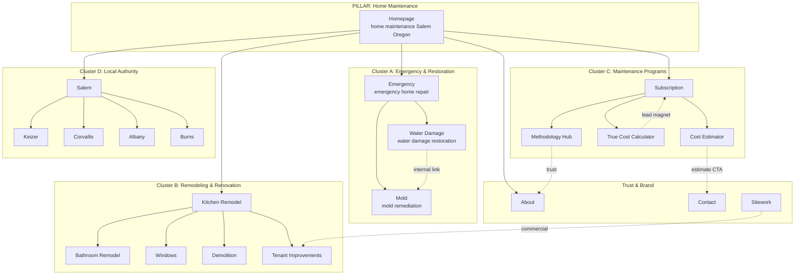

# Keyword Map v1 — Benson Home Solutions (Agent 04 Deliverable)

> [!NOTE]
> **Sprint 1 Deliverable** — Agent 04 (Keyword Research & Content Strategist)

---

## 1 · Keyword Strategy Overview

**Brand positioning:** Benson Home Solutions is a **maintenance, restoration, and mitigation** company — NOT a handyman service. Keywords must reinforce this professional positioning.

**Geographic focus:**

- **Primary:** Mid-Willamette Valley — Salem, Keizer, Corvallis, Albany, Lebanon, Sweet Home
- **Secondary:** Harney County — Burns, Riley, Drewsey
- **Tertiary:** Greater Oregon (for True Cost Calculator national reach)
**Search intent distribution across 21 pages:**

- **Transactional (ready to hire):** Emergency, Water Damage, Service pages — 60% of page portfolio
- **Commercial investigation:** Subscription, True Cost Calculator, Cost Estimator — 20%
- **Informational/trust-building:** About, Methodology Hub, Area pages — 20%
**Competitive landscape:** Key competitors in the Mid-Willamette Valley include SERVPRO of Salem West, Willamette Valley Restoration (WVR), Oregon Restoration, Summit Cleaning & Restoration, Liberty Homes Construction (Corvallis), and ServiceMaster of Salem. Most focus narrowly on restoration only — **Benson's maintenance-first positioning is a gap no competitor fills.**

---

## 2 · Master Keyword Map — All 21 Pages

### Topical Cluster A: Emergency & Restoration (P0 — Critical)

### Topical Cluster B: Core Services (P1 — High Priority)

### Topical Cluster C: Specialty Services (P2 — Medium Priority)

### Topical Cluster D: Area Pages (P3 — Local SEO)

### Topical Cluster E: Tools & Calculators (P4 — Lead Magnets)

---

## 3 · Topical Cluster Architecture

**Internal linking strategy:**

- Every service page links to related area pages ("We serve Salem, Keizer, Corvallis, Albany, Burns")
- Every area page links to all service pages
- Emergency → Water Damage → Mold form a restoration chain
- True Cost Calculator → Subscription → Methodology form a conversion funnel
- All pages link to Contact and Emergency (sticky header CTAs)
---

## 4 · Content Briefs (P0 Pages — Immediate Priority)

### Homepage Content Brief

> [!NOTE]
> **Target:** "home maintenance Salem Oregon" + brand queries

### Emergency Page Content Brief

> [!NOTE]
> **Target:** "emergency home repair Salem Oregon" + "24/7 emergency restoration Oregon"

### Water Damage Page Content Brief

> [!NOTE]
> **Target:** "water damage restoration Salem Oregon" + "water mitigation Oregon"

---

## 5 · Keyword Prioritization Matrix

---

## 6 · Competitive Keyword Gaps

**What competitors rank for that Benson does NOT (yet):**

- "restoration contractor near me" — SERVPRO, Oregon Restoration dominate
- "mold removal Salem Oregon" — ServiceMaster, Summit Cleaning rank well
- "water damage repair cost Oregon" — informational gap, no local company owns this
- "emergency home repair 24/7" — SERVPRO owns this with aggressive PPC + organic
**What NO competitor in Mid-Willamette Valley targets:**

- ✅ "home maintenance subscription Oregon" — **ZERO competition**
- ✅ "true cost of homeownership calculator" — **national opportunity, no local player**
- ✅ "preventive home maintenance program" — **gap in market**
- ✅ "church maintenance contractor Oregon" — **niche commercial opportunity**
- ✅ "property maintenance with SLA" — **professional positioning gap**
**Strategic advantage:** Benson's maintenance-first positioning lets it own keywords that pure restoration companies (SERVPRO, Oregon Restoration, WVR) don't target. The subscription model is the SEO blue ocean.

---

## 7 · Next Steps

- [ ] **Agent 03:** Use keyword targets + long-tail variations to build entity checklists per page
- [ ] **Agent 10:** Write P0 page copy using primary/secondary keywords and content briefs above
- [ ] **Agent 06:** Design wireframes informed by content hierarchy and CTA placement
- [ ] **Agent 02:** Expand JSON-LD schema templates using entity targets per page
- [ ] **Agent 05:** Use keyword map to prioritize citation sources and directory listings
- [ ] **Agent 04 (self):** Refine with GSC data once Elric grants access; validate volumes with Search Console impressions
> [!NOTE]
> **Volume estimates** are based on industry benchmarks, competitor analysis, and regional market sizing. Actual volumes will be validated with Google Search Console data once access is granted. All estimates should be treated as directional, not absolute.

