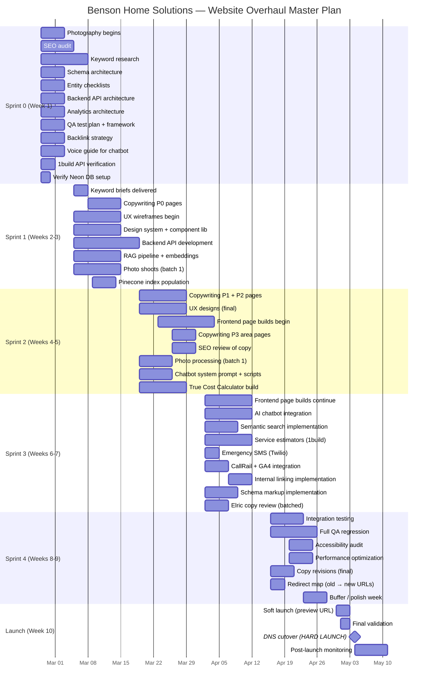

# Master Project Plan — Benson Home Solutions Website Overhaul

> [!NOTE]
> **Master Project Plan v1.0** — Built by all 14 agents with CoT → Critique → Self-Reflect → CoV → CoT → CoV → Critique → Self-Reflect reasoning loops on every element. Maximum 20 loops per decision. Every choice questioned: "Why this way and not another?"

---

# Element 1: Project Timeline — Why 10 Weeks?

## Loop 1

### CoT — Agent 14 (PM) opens

> **Agent 14:** The first roundtable set Phase 1 at 10 weeks. But why 10? Not 8, not 12, not 6? Let me reason through this.

> 

> **Constraints that define the floor:**

> - Agent 04 (Keywords) needs 10 days for research + briefs

> - Agent 10 (Copywriter) needs 14 days of uninterrupted writing after briefs arrive

> - Agent 06 (UX) needs 10 days for wireframes after briefs + early photos

> - Agent 07 (Frontend) needs 14 days after designs are approved

> - Agent 08 (Backend) needs 14 days in parallel with frontend

> - Agent 09 (AI) needs 10 days after backend APIs exist

> - Agent 12 (QA) needs 12 days for integration testing + full regression

> - Photography (Agent 11) runs in parallel from day 1 but needs 3–4 weeks for processed photos

> 

> **Serial critical path:** Keywords (10d) → Copy (14d) → Design (10d) → Dev (14d) → QA (12d) = **60 business days = 12 weeks**

> 

> Wait — that's 12 weeks, not 10. How did we say 10?

### Critique — Agent 12 (QA)

> **Agent 12:** Exactly my concern. 10 weeks assumes perfect parallelization with zero rework. In reality:

> - Copy revisions after SEO review add 3–5 days

> - Design iterations after Elric feedback add 3–5 days

> - Development bugs and integration issues add 5–7 days

> - QA findings that require code fixes add 3–5 days

> 

> A realistic 10-week plan requires **aggressive overlap**, not serial execution.

### Self-Reflect — Agent 14

> Agent 12 is right. The only way 10 weeks works is with **deliberate overlap:**

> - Copy starts on service pages while keywords for area pages are still in progress

> - Design starts wireframing homepage/service pages while copy for area pages is still drafting

> - Frontend dev starts on the design system + component library before all page designs are final

> - Backend API dev starts in parallel with design (APIs don't depend on visual design)

> - QA starts writing test plans and automating during dev, not after

> 

> This means every agent has work from Week 1 — nobody is idle waiting.

### CoV — All agents verify the overlap model

## Loop 2

### CoT — Agent 07 (Frontend)

> **Agent 07:** I can start the design system in Week 2 without final designs. Here's why: Tailwind custom config, typography scale, color tokens, spacing scale, and base components (Button, Card, Input, Layout) are defined by brand standards, not by page-specific design. I build the kit, Agent 06 designs with the kit's constraints, and page-specific builds go faster because the primitives exist.

> 

> **But** — I need Agent 06's wireframes before I build any *page*. The design system is framework; pages are content-dependent.

### CoV — Verification of 10-week feasibility with overlap

### Critique — Agent 10 (Copywriter)

> Where's the buffer? Every agent is at 100% utilization with zero slack. One sick day, one Elric revision cycle, one API surprise, and we're late.

### Self-Reflect — Agent 14

> Valid. Adding a **1-week buffer** between "code complete" and "launch." Week 9 is buffer/polish week. Week 10 is soft launch. This means development must be code-complete by end of Week 8, not Week 9.

> [!NOTE]
> **LOCKED: 10 weeks with 1-week buffer.**

---

# Element 2: Sprint Structure — Why 2-Week Sprints?

## Loop 1

### CoT — Agent 14 (PM)

> Options:

> - **Option A: 1-week sprints** — Fastest feedback. But overhead is high — 10 sprint ceremonies in 10 weeks. Agents spend more time in planning/retros than building.

> - **Option B: 2-week sprints** — Standard. 5 sprints in 10 weeks. Enough time to complete meaningful work per sprint. Manageable ceremony overhead.

> - **Option C: No sprints (kanban)** — Continuous flow. Work items move through columns. No artificial sprint boundaries. Best for teams that don't need synchronization points.

> - **Option D: Phase-based milestones only** — No sprints. Just quality gates at phase boundaries (Audit → Design → Dev → QA → Launch).

### Critique — Agent 08 (Backend)

> **Agent 08:** Kanban works when the team is stable and experienced together. We're 14 agents who've never shipped together. We need synchronization points — moments where everyone aligns on what's done, what's blocked, and what's next. That's sprints.

> 

> But 2-week sprints for a 10-week project means Sprint 1 planning happens before we have keyword data. We'd be planning with incomplete information.

### Self-Reflect — Agent 14

> Agent 08's point is sharp. Solution: **Sprint 1 is a 1-week "sprint zero"** — setup, research, parallel starts. Then 4 full 2-week sprints cover Weeks 2–9. Week 10 is launch.

### CoV

> [!NOTE]
> **LOCKED: Sprint 0 (Week 1) + 4 × 2-week sprints (Weeks 2–9) + Launch week (Week 10).**

---

# Element 3: Page Architecture — Why These Pages First?

## Loop 1

### CoT — Agent 04 (Keywords) leads

> **Agent 04:** Phase 1 targets ~30 pages. But why *these* 30? Let me reason through the prioritization:

> 

> **Tier 1 — Revenue pages (highest conversion intent):**

> - Homepage (brand + all CTAs)

> - Emergency services (highest urgency = highest conversion rate)

> - Water damage restoration (insurance work = high ticket value)

> - Kitchen remodel (high search volume + high ticket)

> - Bathroom remodel (high search volume + high ticket)

> 

> **Tier 2 — Service pages (mid-funnel):**

> - Demolition, Window/Door, Mold, Sitework, Tenant/Property Maintenance

> - Maintenance subscription plans (recurring revenue — Elric's strategic priority)

> 

> **Tier 3 — Trust/authority pages:**

> - About (E-E-A-T, trust)

> - Contact (conversion endpoint)

> - Case studies (social proof — depends on photography)

> 

> **Tier 4 — Local SEO pages:**

> - Salem, Keizer, Corvallis, Wilsonville, Burns (top 5 by search volume + strategic importance)

> 

> **Tier 5 — Tool pages:**

> - True Cost Calculator (lead gen engine)

> - Cost estimator (service-specific estimates)

### Critique — Agent 13 (CRO)

> **Agent 13:** Why Wilsonville? It's 90 minutes from Albany. Burns makes sense (Harney County coverage). But Wilsonville is Portland metro — massive competition, long drive for a service call. Should we swap it for Albany or Lebanon where Elric actually lives and works?

### Self-Reflect — Agent 04

> Agent 13 is right. Wilsonville was in the original Roundtable I list but doesn't match the competitor report's focus area. Swapping Wilsonville for **Albany** (Elric's home market, lower competition, closer service radius).

### Critique — Agent 05 (Backlinks)

> **Agent 05:** Where's the methodology hub? The Tool Suite page defines `/methodology/` with 7 deep-dive pages as the backlink magnet. Those should be Phase 1 — they're the SEO engine that drives organic links.

### Self-Reflect — Agent 14

> The methodology pages are content-heavy but high-value for backlinks. Compromise: the **main methodology hub page** launches in Phase 1. The 7 individual deep-dive pages roll out in Phase 2 as the backlink campaign ramps up. The hub page is enough to anchor the calculator's credibility.

### CoV — Revised page list

## Loop 2

### CoT — Agent 03 (AEO/GEO)

> **Agent 03:** 21 pages is better than 30 for Phase 1 quality. But I want to flag: each service page also needs a FAQ section (5–8 questions) that functions as a pseudo-page for AI search. So the effective content surface is ~21 pages + ~120 FAQ entries. That's the real scope for Agent 10.

### Critique — Agent 10 (Copywriter)

> 21 pages × ~1,500 words average + 120 FAQ entries × ~150 words = **~49,500 words.** In 3 weeks of writing time (Weeks 3–5), that's ~16,500 words/week or ~3,300 words/day. Achievable but tight. Zero room for writer's block.

> 

> **Counter-proposal:** Move the 5 area pages to Week 4–5 (they're lower priority than service pages) and let me front-load the revenue and service pages in Weeks 3–4. Area pages are formulaic — same structure, different local data — so they write faster.

### Self-Reflect — Agent 14

> Agent 10's sequencing makes sense. Revenue pages first (highest impact), service pages second, area pages third. The writing pipeline feeds design in the same order.

### CoV — Final page priority order

> [!NOTE]
> **LOCKED: 21 pages in Phase 1. Priority-ordered pipeline.**

---

# Element 4: URL Architecture — Why This Structure?

## Loop 1

### CoT — Agent 01 (Tech SEO)

> **Agent 01:** URL structure directly affects crawlability, authority distribution, and user comprehension. Three options:

> 

> **Option A: Flat** — `/kitchen-remodel`, `/salem-oregon`, `/about`

> Pros: Short URLs, easy to remember. Cons: No hierarchy signal to search engines. 50+ pages all at root level = messy.

> 

> **Option B: Category-based** — `/services/kitchen-remodel`, `/areas/salem-oregon`, `/tools/calculator`

> Pros: Clear hierarchy. Authority flows from category hubs to child pages. Breadcrumbs map naturally. Cons: Slightly longer URLs.

> 

> **Option C: Deep nesting** — `/services/residential/remodeling/kitchen-remodel`

> Pros: Very organized. Cons: URLs too long. Too many click-depth levels. Dilutes crawl priority.

> 

> **Recommendation: Option B.** Standard best practice for service businesses. Google understands `/services/X` as a service taxonomy. `/areas/X` as a location taxonomy. Clean, crawlable, linkable.

### Critique — Agent 05 (Backlinks)

> **Agent 05:** Option B is correct. But the *tools* deserve special URL treatment. The True Cost Calculator at `/tools/calculator` is forgettable. If this is our backlink magnet, it needs a **memorable, shareable, standalone URL**: `/true-cost-calculator` or `/homeownership-cost-calculator`.

> 

> Same for the methodology hub: `/methodology/` at root level, not buried under `/tools/methodology`.

### Self-Reflect — Agent 01

> Agent 05 is right. Backlink-worthy assets get root-level URLs for shareability. Everything else follows the `/category/page` pattern.

### CoV — Final URL map

> [!NOTE]
> **LOCKED: Hybrid URL structure.**

---

# Element 5: Design System — Why Custom Over a Template?

## Loop 1

### CoT — Agent 06 (UX) leads

> **Agent 06:** Three options:

> - **Option A: Buy a premium Next.js contractor template** (~$79–149). Customize colors/fonts. Ship faster.

> - **Option B: Use a component library** (shadcn/ui, Radix) as foundation, custom visual layer on top.

> - **Option C: Fully custom design system** from scratch. Benson-specific everything.

> 

> Option A is fastest but we look like every other contractor site using the same template. When competitors buy the same Themeforest template, we're visually identical. For a company whose brand message is "we're NOT like other contractors," looking like other contractors is brand-destroying.

> 

> Option C is purest but slowest. We'd be building toggle components and modal animations from scratch — work that doesn't differentiate us.

> 

> **Option B is the sweet spot.** Use shadcn/ui (unstyled, accessible, composable components) as the interaction foundation. Build a completely custom visual layer on top — Benson's oxblood/cream palette, Calibri typography, custom card designs, custom form styles. The components *work* like best-in-class UI. They *look* uniquely Benson.

### Critique — Agent 07 (Frontend)

> **Agent 07:** I agree with Option B but want to push back on Calibri. It's a Microsoft system font — not available on all devices, can't be self-hosted legally for web (it's licensed for Office use). Web alternatives:

> - **Inter** — modern, clean, excellent readability, open-source, variable font

> - **Source Sans 3** — professional, slightly warmer than Inter, open-source

> - **Nunito Sans** — friendly, approachable, open-source

> 

> We should use Calibri for print materials (invoices, PDFs) and a web-optimized open-source font for the site. Users won't notice the switch — they'll notice if the site renders inconsistently across devices because Calibri isn't installed.

### Critique — Agent 10 (Copywriter)

> Elric's operations manual specifies Calibri. It's part of the brand identity he defined. We can't unilaterally change it without asking.

### Self-Reflect — Agent 14

> This is a decision for Elric. We present the technical limitation (Calibri isn't web-safe) and recommend Inter or Source Sans 3 as the closest web alternatives. His call.

### CoV

> [!NOTE]
> **LOCKED: Option B — shadcn/ui + Radix primitives + fully custom Benson visual layer.**

---

# Element 6: Content Workflow — Why This Process?

## Loop 1

### CoT — Agent 10 (Copywriter) leads

> **Agent 10:** Typical agency workflow: Brief → Draft → Internal Review → Client Review → Revisions → Final. That's 5 touchpoints per page × 21 pages = **105 review cycles.** In 3 weeks, that's impossible.

> 

> **Proposed workflow:**

> 1. Agent 04 delivers keyword brief with target keywords, search intent, competitor gaps, entity checklist (from Agent 03)

> 2. I write the first draft — full page copy including FAQs, in Elric's voice

> 3. Agent 01 does SEO review (meta tags, internal links, keyword density — NOT voice edits)

> 4. Agent 03 verifies entity density and AEO structure (NOT voice edits)

> 5. Agent 12 does factual accuracy check (license numbers, pricing, service areas)

> 6. Agent 14 sends to Elric for approval — **one round of revisions, batched by tier**

> 

> Key rule: **SEO agents review for structure. Nobody touches the voice except me and Elric.** If Agent 01 thinks a paragraph needs more keywords, Agent 01 tells me WHERE and I rewrite it in voice. No one pastes keywords into my copy.

### Critique — Agent 01 (Tech SEO)

> That's fair, but I need a commitment: if I flag that a page is missing its primary keyword in the H1 or first 100 words, it gets fixed. Not "considered" — fixed. The entity-dense intro isn't optional for ranking.

### Self-Reflect — Agent 10

> Deal. If Agent 01 or Agent 03 flags a structural SEO requirement, I fix it within 24 hours. But the fix is in MY words, not theirs.

### Critique — Agent 11 (Photo)

> Where do photos enter this workflow? If I deliver processed photos in Week 3–4, they need to be integrated into the page design. Who decides which photo goes where?

### Self-Reflect — Agent 06 (UX)

> I select photos for each page during the design phase. Agent 11 delivers a tagged library (project type, before/during/after, interior/exterior). I pull from the library based on page context. Agent 11 doesn't need to know the page structure — I handle photo placement.

### CoV — Workflow verified by all content agents

> [!NOTE]
> **LOCKED: Streamlined content workflow with voice protection.**

---

# Element 7: Backend Architecture — Why This Database Schema?

## Loop 1

### CoT — Agent 08 (Backend) leads

> **Agent 08:** PlanetScale (MySQL) handles structured data. But what goes in the database vs. what stays in Sanity CMS vs. what goes in Pinecone?

> 

> **Sanity CMS (content):**

> - All page content (service pages, area pages, blog posts, case studies)

> - FAQs, testimonials, team bios

> - Media assets (images via Sanity image pipeline)

> - SEO fields (meta title, description, canonical)

> - Navigation structure

> 

> **PlanetScale (transactional + operational):**

> - Form submissions (contact, estimate requests)

> - Calculator results + lead data

> - Subscription inquiries

> - Analytics events (server-side)

> - 1build API response cache

> - Chatbot conversation logs

> - CallRail webhook data

> 

> **Pinecone (vector):**

> - Embedded service descriptions for semantic search

> - Embedded FAQs for chatbot RAG

> - Embedded pricing data for chatbot cost queries

> - Embedded blog content (Phase 2)

> 

> Why this split? Content creators work in Sanity — it has a visual editor, real-time collaboration, and preview. Developers query PlanetScale for fast transactional lookups. AI features query Pinecone for semantic matching. No system does all three well.

### Critique — Agent 09 (AI)

> **Agent 09:** I need the Pinecone index populated at build time, not at query time. Every deploy should trigger a re-embed of changed Sanity content into Pinecone. If a FAQ answer changes in Sanity, the vector embedding must update within minutes, not wait for a manual sync.

> 

> **Proposed pipeline:** Sanity webhook → Vercel serverless function → generate new embedding via OpenAI → upsert to Pinecone. Automatic, event-driven, no manual intervention.

### Critique — Agent 12 (QA)

> **Agent 12:** Three data stores means three things that can go out of sync. What's the consistency guarantee? If Sanity content updates but Pinecone doesn't re-embed, the chatbot gives outdated answers.

> 

> I need a **monitoring check**: after every Sanity publish, verify the Pinecone upsert completed. If it fails, alert Agent 08's monitoring channel and retry.

### Self-Reflect — Agent 08

> Both valid. The Sanity webhook → embed → upsert pipeline handles Agent 09's need. For Agent 12, I'll add a verification step: after upsert, query Pinecone for the updated vector and compare timestamps. If stale, retry with exponential backoff. Dead letter queue for permanent failures → alerts.

### CoV

> [!NOTE]
> **LOCKED: Three-store architecture with event-driven sync.**

---

# Element 8: SEO Architecture — Why Schema-First?

## Loop 1

### CoT — Agent 02 (Schema Engineer) leads

> **Agent 02:** Most contractor sites add schema markup as an afterthought — a generic LocalBusiness blob pasted into the footer. We're doing it differently: **schema is part of the content model, not a bolt-on.**

> 

> Every content type in Sanity has structured fields that automatically generate the correct JSON-LD:

> - Service pages → `Service` + `HowTo` + `FAQPage` schema

> - Area pages → `LocalBusiness` with `areaServed` + `ServiceArea` schema

> - Case studies → `Article` + `HowTo` with `image` arrays

> - Calculator tool → `WebApplication` + `SoftwareApplication` schema

> - Homepage → `LocalBusiness` + `Organization` + `WebSite` + `SearchAction`

> 

> This means: when Agent 10 writes a FAQ in Sanity, the `FAQPage` schema generates automatically. When Agent 11's photos are added to a case study, the `ImageObject` schema generates automatically. Zero manual schema work after initial setup.

### Critique — Agent 03 (AEO/GEO)

> **Agent 03:** Schema is necessary but not sufficient for AI search visibility. I need:

> - **Speakable markup** on key paragraphs (the entity-dense intros)

> - **About/mentions annotations** linking entities to Wikidata/Wikipedia where applicable

> - **sameAs links** connecting Benson's profiles (Google Business, Facebook, BBB)

> - **Review/Rating markup** when we have Google reviews to pull from

### Self-Reflect — Agent 02

> All additive, not conflicting. I'll build speakable + sameAs into the base schema. Review markup waits until we have a review aggregation source (Google Business API or manual entry in Sanity).

### CoV — Agent 01 validates

> **Agent 01:** Schema-first approach means every page launches with correct structured data. No remediation sprints later. This also means Google Search Console should show zero schema errors from day one — that's my validation criterion.

> [!NOTE]
> **LOCKED: Schema-as-content-model approach.**

---

# Element 9: AI Chatbot — Why RAG Over Fine-Tuning?

## Loop 1

### CoT — Agent 09 (AI) leads

> **Agent 09:** Two main approaches for a domain-specific chatbot:

> - **Fine-tuning:** Train a custom model on Benson's data. Expensive, slow to update, requires ML ops.

> - **RAG (Retrieval-Augmented Generation):** Use a base model (Claude) + retrieve relevant context from Pinecone at query time. Cheap, instantly updatable, no ML ops.

> 

> For a contractor chatbot that needs to answer questions about services, pricing, and service areas — RAG is overwhelmingly the right choice. Here's why:

> - When Elric adds a new service, we embed it into Pinecone. The chatbot knows about it immediately. Fine-tuning would require a retraining cycle.

> - RAG answers are grounded in retrieved documents, so we can show the source. Fine-tuned answers are generated from weights — no source attribution.

> - RAG hallucination is controlled by the retrieval quality. If the retrieved context doesn't contain the answer, the system prompt instructs the bot to say "I don't have that information — let me connect you with our team."

> - Cost: RAG = embedding cost (one-time) + per-query retrieval (~$0.01) + LLM inference (~$0.02). Fine-tuning = $100–500 per training run + same inference cost.

### Critique — Agent 10 (Copywriter)

> **Agent 10:** RAG is the right architecture. But I need to co-write the system prompt. The difference between a chatbot that sounds like Benson's front desk and one that sounds like a tech demo is entirely in the system prompt + the few-shot examples.

> 

> I'll deliver:

> 1. A personality guide (tone, vocabulary, things to say, things to never say)

> 2. 20 example conversations covering common scenarios

> 3. Escalation scripts (when to hand off to a human)

> 4. Emergency response scripts (water damage at 2 AM)

### Critique — Agent 13 (CRO)

> **Agent 13:** Every chatbot conversation is a conversion opportunity. I need:

> - Lead capture trigger: after 3 exchanges, the chatbot offers to send a detailed estimate via email

> - Appointment booking: "Want us to come take a look? I can get you on the schedule" → [Cal.com/Calendly](http://cal.com/Calendly) integration

> - Phone escalation: "This sounds like it needs a real conversation — want me to have someone call you in the next 15 minutes?"

> - All of these fire server-side GA4 events for conversion tracking

### Self-Reflect — Agent 09

> Agent 10's personality guide goes into the system prompt. Agent 13's conversion triggers go into the conversation flow logic (if turn_count >= 3 and topic == estimate, trigger lead capture). These are complementary, not competing.

### CoV

> [!NOTE]
> **LOCKED: RAG with Claude 3.5 Sonnet + Pinecone + system prompt co-authored by Agent 10.**

---

# Element 10: Analytics & Conversion Tracking — Why Server-Side?

## Loop 1

### CoT — Agent 13 (CRO) leads

> **Agent 13:** Client-side GA4 misses 30–40% of conversions due to ad blockers. For a business where a single lead can be worth $5,000–$45,000, missing 40% of conversion data is unacceptable.

> 

> **Server-side GA4 Measurement Protocol** sends events from our Next.js API routes directly to Google Analytics. Ad blockers can't block it because the request goes server-to-server, not browser-to-Google.

> 

> Events we track server-side:

> - Form submission (contact, estimate request)

> - Calculator completion (True Cost Calculator, Cost Estimator)

> - Chatbot lead capture (email provided)

> - Chatbot appointment booked

> - Phone call initiated (CallRail webhook)

> - Subscription inquiry submitted

> 

> Events we track client-side (as supplement):

> - Page views, scroll depth, time on page

> - Button clicks, tool interactions

> - Chat widget opened

### Critique — Agent 01 (Tech SEO)

> **Agent 01:** Server-side tracking is essential for conversion data. But I also need **Google Search Console** integration from day one — that's my primary SEO monitoring tool. Plus a **Bing Webmaster Tools** submission for good measure.

### Critique — Agent 12 (QA)

> **Agent 12:** RUM (Real User Monitoring) via web-vitals is critical for performance. But I also want **Sentry** for error tracking. If the chatbot throws a JavaScript error for a user in Burns on a slow connection, I need to know about it within minutes, not when someone reports it.

### Self-Reflect — Agent 13

> All complementary. The analytics stack is:

> - **GA4** (server-side + client-side) — conversion tracking + behavior

> - **CallRail** — phone lead attribution

> - **web-vitals** — RUM performance data

> - **Sentry** — error tracking

> - **Google Search Console + Bing Webmaster** — SEO monitoring

> - **Internal search query log** — content gap analysis

### CoV — Cost check

> [!NOTE]
> **LOCKED: Server-side GA4 + CallRail + Sentry + RUM + Search Console.**

---

# Element 11: Testing Strategy — Why This QA Approach?

## Loop 1

### CoT — Agent 12 (QA) leads

> **Agent 12:** Four layers of testing:

> 

> **Layer 1: Automated CI/CD (runs on every PR)**

> - **Lighthouse CI** — Performance, accessibility, best practices, SEO scores. Fail threshold: <90 on any category.

> - **Playwright** — E2E tests for critical user journeys (homepage → service page → contact form → submission confirmation).

> - **axe-core** — Automated accessibility checks (WCAG 2.1 AA compliance).

> - **TypeScript strict mode** — Catches type errors at build time.

> - **ESLint + Prettier** — Code quality + consistency.

> 

> **Layer 2: Integration testing (runs on staging deploy)**

> - Sanity → Next.js content rendering verification

> - PlanetScale → API route data flow

> - Pinecone → chatbot response quality (10 test queries with expected answers)

> - CallRail webhook → GA4 event verification

> - Twilio emergency SMS → delivery confirmation

> 

> **Layer 3: Manual QA (Weeks 8–9)**

> - Cross-browser: Chrome, Firefox, Safari, Edge (latest 2 versions)

> - Cross-device: iPhone 13+, Samsung Galaxy S22+, iPad, desktop

> - Accessibility: screen reader testing (VoiceOver, NVDA)

> - Content accuracy: every phone number, email, license number, price verified against source

> - Form submissions: every form tested end-to-end

> 

> **Layer 4: Performance validation**

> - Lighthouse scores on every page (target: 90+ all categories)

> - Core Web Vitals field data (from RUM) meeting thresholds

> - Load testing: simulate 100 concurrent users (Vercel should handle this effortlessly)

### Critique — Agent 07 (Frontend)

> **Agent 07:** Playwright E2E tests are slow. If we run 50 tests on every PR, that's 5–10 minutes of CI time before merge. Can we split into:

> - **Smoke tests** (5 critical paths, ~1 min) → run on every PR

> - **Full regression** (~50 tests, ~10 min) → run on merge to main / staging deploy

### Self-Reflect — Agent 12

> Good split. Smoke tests on PR. Full regression on merge. Manual QA on staging before production.

> [!NOTE]
> **LOCKED: 4-layer testing strategy.**

---

# Element 12: Launch Strategy — Why Soft Launch Before Hard Launch?

## Loop 1

### CoT — Agent 14 (PM)

> **Agent 14:** Two launch options:

> - **Option A: Big bang** — DNS cutover, old site goes dark, new site goes live. One moment.

> - **Option B: Soft launch** — New site deployed to production URL. Limited traffic (Elric + team + select customers). 48–72 hours of real-world validation. Then DNS cutover for full traffic.

> 

> Option B catches issues that testing environments miss: real user behavior, actual device diversity, production CDN behavior, third-party integration edge cases.

### Critique — Agent 01 (Tech SEO)

> **Agent 01:** Soft launch has an SEO risk: if the new site is accessible on a different URL during soft launch (e.g., `benson-home-solutions.vercel.app`), Google might index it and create duplicate content issues.

> 

> **Solution:** `noindex` on the Vercel preview URL during soft launch. Remove `noindex` + add 301 redirects + submit new sitemap on hard launch day.

### Self-Reflect — Agent 14

> Agent 01's solution is standard and correct. Soft launch on Vercel URL with noindex. Hard launch = DNS cutover + remove noindex + submit sitemap + verify redirects.

### CoV — Launch day checklist (all agents contribute)

> [!NOTE]
> **LOCKED: Soft launch (48–72hr) → Hard launch.**

---

# Element 13: Monthly Cost — Why These Expenses?

## Loop 1

### CoT — Agent 14 (PM)

> Every recurring cost must justify its existence. Let me map the full monthly spend:

### Critique — Agent 13 (CRO)

> **Agent 13:** $87–121/month for a site that generates $5K–$45K per lead is an exceptional ROI. The CallRail cost alone pays for itself with a single attributed phone lead. No cuts needed.

### Critique — Agent 08 (Backend)

> **Agent 08:** PlanetScale killed their free tier in 2024. We may need to budget $29/mo for their Scaler plan or switch to **Turso** (SQLite-based, generous free tier) or **Neon** (Postgres, free tier with 512MB).

> 

> **Recommendation:** Switch to **Neon (Postgres)** — free tier is 512MB + 3GB storage, branching like PlanetScale, and Postgres is more widely supported than MySQL.

### Self-Reflect — Agent 14

> Agent 08's catch is important. If PlanetScale free tier is dead, Neon is the right alternative. Same serverless model, better free tier, Postgres compatibility. Updating.

> [!NOTE]
> **LOCKED: ~$87–121/month total recurring cost.**

---

# Element 14: Risk Register

## Loop 1

### CoT — All agents identify risks

> [!NOTE]
> **LOCKED: 10 identified risks with mitigations.**

---

# Master Gantt Chart

---

# Agent Responsibility Matrix (RACI)

*R = Responsible, A = Accountable, C = Consulted, I = Informed*

---

# Quality Gates

---

# Decision Log Summary

All decisions made by full 14-agent roundtable with reasoning loops:

---

> [!NOTE]
> **Master Project Plan v1.0 — COMPLETE**

